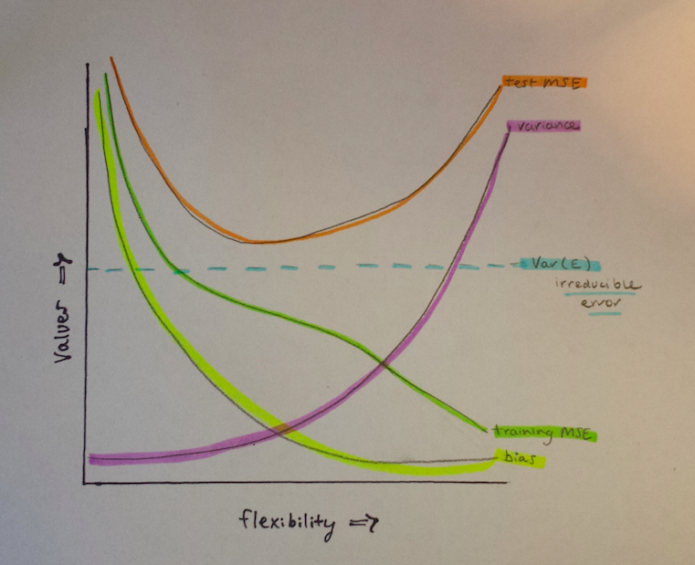

# Topic 1 Exercises

### Hannah Sonsalla

## Discussion Questions
### ISL 2.4.1
For each parts (a) through (d), indicate whether we would generally expect the performance of a flexible statistical learning method to be better or worse than an inflexible method.

a) The sample size *n* is extremely large and the number of predictors *p* is small.

I would expect the performance of a flexible statistical learning method to perform better.  It will fit the data closer and perform better given the large sample size.

b) The number of predictors *p* is extremely large and the number of observations *n* is small.

I would expect the performance of a flexible statistical learning method to perform worse in this situation.  A flexible method would overfit the small number of observations and follow the errors too closely.

c) The relationship between the predictors and response is highly non-linear.

I would expect the performance of a flexible statistical learning method to perform better.  The flexible model has more degrees of freedom which will allow it to take on a non-linear shape.  

d) The variance of the error terms is extremely high.

I would expect the performance of a flexible statistical learning method to perform worse than an inflexible model.  Once again, a flexible model would follow the errors or noise too closely and increase variance.

### ISL 2.4.3
 We now revisit the bias-variance decomposition.
 
a) Provide a sketch of typical (squared) bias, variance, training error,
test error, and Bayes (or irreducible) error curves, on a single
plot, as we go from less flexible statistical learning methods
towards more flexible approaches. The x-axis should represent
the amount of flexibility in the method, and the y-axis should
represent the values for each curve. There should be five curves.
Make sure to label each one.



b) Explain why each of the five curves has the shape displayed in
part (a).

Training MSE and Testing MSE:  As flexibility increases, there is a monotone decrease in the training MSE and a U-shape in the test MSE.  These properties hold true regardless of the data set and statistical method used.  The training MSE decreases in this fashion because as flexibility increases the $f$ curve fits the data more closely.  The test MSE initially decreases and levels off, but then increases again to form a U-shape as flexibility increases.  It is key to note that as flexibility increases, training MSE will always decrease, but test MSE may not.  If a method produces a small training MSE but a large test MSE, the data is getting overfitted (procedure working too hard to find patterns in training data and may be picking up patterns caused by random chance).  
 
Typical bias and Variance: The typical (squared) bias decreases as flexibility increases where as variance increases as flexibility increases.  This can be taken as a general rule.  Variance is the amount by which $f$ hat, our estimate for $f$, would change if we estimated it using a different training data set.  If the curve fits the data closely, then changing any data point may cause the estimate for $f$ hat to change drastcially and will result in variance.  Bias is the error that is introduced by approximating a real-life problem by a simpler model.  For example, if we choose to use a simple linear regression model, it is highly unlikely that a real-life problem has this type of simple relationship.  Performing linear regression will result in bias in the estimatation of $f$.   

Irreducible error:  Irreducible error is a constant, thus it is modeled as a horizontal line in my sketch.  It is below the test MSE curve because it represents the lowest achievable test MSE among all possible methods. 


### ISL 2.4.6
Describe the differences between a parametric and a non-parametric
statistical learning approach. What are the advantages of a parametric
approach to regression or classification (as opposed to a nonparametric
approach)? What are its disadvantages?

A parametric statistical learning approach reduces the problem of estimating $f$ down to one of estimating a set of parameters. It assumes a parametric form for $f$.

A non-parametric approach does not assume a patricular form of $f$.  It requires a very large sample (large number of observations) to get a correct estimate of $f$.

The advantages of a parametric approach to regression or classification include simplifying the estimation of $f$ to a few parameters and requiring less observations than compared to a non-parametric approach.

The disadvantages of a parametric approach to regression or classification include a potentially inaccurate estimate of $f$ if the form of $f$ is too far from true $f$ or if more flexible models are used that lead to overfitting the data.

## Computing Assignment
### ISL 2.4.8
a)
```{r}
library(ISLR)
data(College)
college <- read.csv("College.csv")
#download.file("http://www-bcf.usc.edu/~gareth/ISL/College.csv", destfile="College.csv")
#college_file_name <- "/home/local/MAC/hsonsall/Math-253-Assignment/College.csv"
#college = read.csv(college_file_name, header=T, na.strings="?")
```
b)
```{r}
#fix(college) - book command does not work
head(college[,1:3])

rownames = college[, 1]
#rownames(college) = college[,1] - book version did not work correctly

college = college[,-1]

head(college[,1:3])

```
c)
Parts 1, 2, 3
```{r}
summary(college)
pairs(college[,1:10])
plot(college$Private, college$Outstate, xlab = "Private University", ylab = "Out Of State Tuition", main = "Outstate Tuition Plot")
```

Part 4
```{r}
Elite = rep("No", nrow(college))
Elite[college$Top10perc > 50] = "Yes"
Elite = as.factor(Elite)
college = data.frame(college, Elite)
summary(college$Elite)
```

There are 78 elite universities and 699 universities that are not elite.

```{r}
plot(college$Elite, college$Outstate, xlab = "Elite University", ylab = "Out of State Tuition", main = "Outstate Tuition Plot")
```

Part 5
```{r}
par(mfrow=c(2,2))
hist(college$Books, col = "red", breaks = 3, xlab = "Books")
hist(college$Books, col = "aquamarine", breaks = 5, xlab = "Books")
hist(college$Books, col = "plum", breaks = 10, xlab = "Books")
hist(college$Books, col = "peachpuff", xlab = "Books")

par(mfrow=c(2,2))
hist(college$perc.alumni, col = "red", xlab = "Percent Alumni")
hist(college$Grad.Rate, col = "aquamarine", xlab = "Graduation Rate")
hist(college$PhD, col = "plum", xlab = "PhD")
hist(college$Personal, col = "peachpuff", xlab = "Personal")
```

Part 6
Continued data exploration:
```{r}
summary(college$Grad.Rate)
```

It seems odd that some universities have a 118% graduation rate.  I want to find out how many universities this applies to and which universities they are.

```{r}
high_grad_rate <- college[college$Grad.Rate == 118,]
nrow(high_grad_rate)
rownames[as.numeric(rownames(high_grad_rate))]
```

```{r}
summary(college$S.F.Ratio)
```

I want to know more about which universities have the a student/faculty ratio less than 5.  Let's see which universities meet this requirement.
```{r}
low_sf_ratio <- college[college$S.F.Ratio < 5,]
nrow(low_sf_ratio)
rownames[as.numeric(rownames(low_sf_ratio))]
```


### ISL 2.4.9
```{r}
data(Auto)
auto <- read.csv("Auto.csv", na.strings="?")
auto = na.omit(auto)

#download.file("http://www-bcf.usc.edu/~gareth/ISL/Auto.csv", destfile="Auto.csv")
#auto_file_name <- "/home/local/MAC/hsonsall/Math-253-Assignment/Auto.csv"
#auto <- read.csv(auto_file_name, na.strings="?")

# Omit rows containing missing observations
#auto = na.omit(Auto)


```
a)
```{r}
summary(auto)
```
The following predictors are quantitative: mpg, cylinders, displacement, horsepower, weight, acceleration, year and origin.  The predictor name is categorical (qualitative). 

b)
Using the information from the summary command above, I was able to answer this question.
The quantitative predictor mpg ranges from 9.0 to 46.6. The quantitative predictor cyclinders ranges from 3 to 8.  The quantitative predictor displacement ranges from 68 to 455.  The quantitative predictor horsepower ranges 46 to 230.  The quantitative predictor weight ranges from 1613 to 5140.  The quantitative predictor acceleration ranges from 8.0 to 24.8.  The quantitative predictor year ranges from 70 to 82. The quantitative predictor origin ranges from 1 to 3.  

c)
```{r}
sapply(auto[, -c(9)], mean)

sapply(auto[, -c(9)], sd)
```

d)
```{r}
auto_subset <- auto[-c(10:85),-c(9)]
sapply(auto_subset, range)
sapply(auto_subset, mean)
sapply(auto_subset, sd)

```

e)
I created a scatterplot matrix, a scatterplot for every pair of variables for the Auto data set 
```{r}
pairs(auto[,])
```

These scatterplots are able to highlight many relationships among predictors.  It is evident that newer cars (as years increase) tend to have better mpg.  It also appears that Japanese cars (3) have better mpg than European cars (2) and American cars (1).  Cars with 4 cylinders tend to have higher mpg than cars with 3,5,6 or 8 cylinders.  It seems that as displacement, horsepower and weight increase, mpg decreases.  It is hard to tell exactly what the relationship between mpg and name is, although I doubt that there is anything worthwhile.    

We can also look at the predictor origin.  The plots indicate that American cars have greater displacement, horsepower and weight.  European cars have the fastest acceleration.  It seems that many cars have American names.  

f)
Using the scatterplots from the previous question, I can confidently say that cylinders, year and origin can be used as predictors for mpg.  The relationship between these variables and mpg is rather distinct.  Displacement, horsepower and weight all look to have a similar relationship with mpg.  If need be, we could use one of these three as a predictor, but there is no need to incorporate all of them.

## Theory Assignment
### ISL 2.4.2
Explain whether each scenario is a classification or regression problem,
and indicate whether we are most interested in inference or prediction.
Finally, provide n and p.

a) We collect a set of data on the top 500 firms in the US. For each
firm we record profit, number of employees, industry and the
CEO salary. We are interested in understanding which factors
affect CEO salary.

This scenario is a regression problem as the response variable, CEO salary is quantitative.  We are most interested in inference, that is we want to further understand the relationship between the response (CEO salary) and the predictors (profit, number of employees, industry).  For this problem, $n$ = 500 and $p$ = 3.

b) We are considering launching a new product and wish to know
whether it will be a success or a failure. We collect data on 20
similar products that were previously launched. For each product
we have recorded whether it was a success or failure, price
charged for the product, marketing budget, competition price,
and ten other variables.

This scenario is a classification problem as the response variable, success or failure, is qualitative.  We are most interested in prediction, that is we want to predict in the future whether products will be successful or fail.  For this problem, $n$ = 20 and $p$ = 13. 

c) We are interesting in predicting the % change in the US dollar in
relation to the weekly changes in the world stock markets. Hence
we collect weekly data for all of 2012. For each week we record
the % change in the dollar, the % change in the US market,
the % change in the British market, and the % change in the
German market.

This scenario is a regression problem as the response variable, % change is US dollar is quantitative.  We are most interested in prediction, that is we want to predict in the future the % change in the US dollar.  For this problem, $n$ = 52 and $p$ = 3.

### ISL 2.4.7
a) Compute the Euclidean distance between each observation and
the test point, X1 = X2 = X3 = 0.

```{r}
#Observation 1
sqrt((0-0)^2 + (0-3)^2 + (0-0)^2)
#Observation 2
sqrt((0-2)^2 + (0-0)^2 + (0-0)^2)
#Observation 3
sqrt((0-0)^2 + (0-1)^2 + (0-3)^2)
#Observation 4
sqrt((0-0)^2 + (0-1)^2 + (0-2)^2)
#Observation 5
sqrt((0--1)^2 + (0-0)^2 + (0-1)^2)
#Observation 6
sqrt((0-1)^2 + (0-1)^2 + (0-1)^2)
```


b) What is our prediction with K = 1? Why?

If K = 1, then we use observation 5 since it is the closest observation to X0.  Observation 5 is green and the resulting probability for our estimation is 1/1 for green.  Our prediction is green.  

c) What is our prediction with K = 3? Why?

If K = 3, then we use observations 5, 6 and 2 since these are the 3 closest observations to X0.  Observations 2 and 6 are red, whereas observation 5 is green.  In this case, our prediction is red since 2 out of the 3 observations are red and only 1 out of the 3 observations is green.  

d) If the Bayes decision boundary in this problem is highly nonlinear, then would we expect the best value for K to be large or small? Why?

If the decision boundary is highly nonlinear, we would expect the best value for K to be small.  As K grows, the method becomes less flexible and creates a decision boundary that is almost linear.  