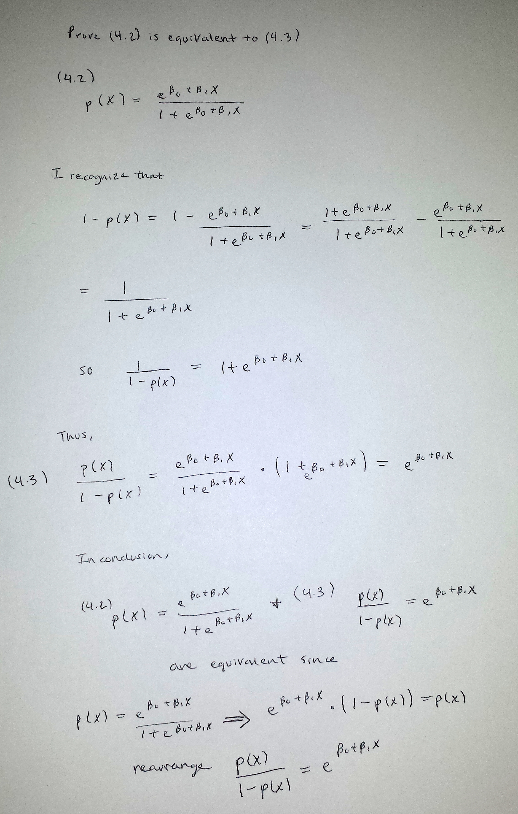

# Topic 4 Exercises: Classification

### Hannah Sonsalla

## Programming Assignment
### 4.7.11 
```{r}
# Load library
library(ISLR)
```

a)
```{r}
# Create vector of length(mpg) containing all 0s
mpg01 = rep(0, length(Auto$mpg))
# Transforms to 1 all of the elements for which mpg is greater than median mpg
mpg01[Auto$mpg > median(Auto$mpg)] = 1
# Adds mpg01 to data set
Auto = data.frame(Auto, mpg01)
dim(Auto)
```

b) Explore data graphically to investigate association between mpg01 and other features.
```{r}
cor(Auto[, -9])
```

I can examine the corelation coefficients to determine which variables appear to have a strong association with mpg01.  Cylinders, displacement, horsepower and weight have corelation coefficents of -0.7591939, -0.7534766, -0.6670526 and -0.7577566 respectively.  This indicates that there is a strong relationship between each of these variables and mpg01 because they are not close to 0.  Acceleration, year and origin have coefficents that are closer to 0 so I ruled them out.

Here are some scatterplots of the data:
```{r}
pairs(Auto)
```

Now I will create boxplots to show the relationship between mgp01 and cylinders, displacement, horsepower and weight.

mgp01 and cylinders:
```{r}
boxplot(cylinders ~ mpg01, data = Auto, main = "Cylinders vs mpg01")
```

mgp01 and displacement:
```{r}
boxplot(displacement ~ mpg01, data = Auto, main = "Displacement vs mpg01")
```

mgp01 and horsepower:
```{r}
boxplot(horsepower ~ mpg01, data = Auto, main = "Horsepower vs mpg01")
```

mgp01 and weight:
```{r}
boxplot(weight ~ mpg01, data = Auto, main = "Weight vs mpg01")
```

As shown in the box plots, there is an obvious association between the plotted variables.  The boxes do not overlap.  Here is a plot for Acceleration vs mpg01 for contrast.

mgp01 and acceleration:
```{r}
boxplot(acceleration ~ mpg01, data = Auto, main = "Acceleration vs mpg01")
```

Acceleration was one of the features that I found would not be useful in predicting mpg01.  The boxplot above reflects this as there is not a significant difference in acceleration based on given mpg01 values.  The boxes overlap, making it hard to distinguish an association between the features.

All in all, I conclude that there is an association between mgp01 and cylinders, displacement, horsepower and weight.

c) Split the data into a training set and a test set.

```{r}
# Create train to hold logical vector of True for even year and False for odd year
train = (Auto$year %% 2 == 0)
# Train data where instances have even years
Auto.train = Auto[train, ]
# Data not in train is test data, test data where instances have odd years
Auto.test = Auto[!train, ]
# mpg01.test values
mpg01.test = mpg01[!train]

```

d) Perform LDA on the training data in order to predict mpg01 using the variables that seemed most associated with mpg01 in (b). What is the test error of the model obtained?

```{r}
library(MASS)
# Perform LDA on training data
lda.fit = lda(mpg01 ~ cylinders + displacement + horsepower + weight, data = Auto, subset = train)
lda.fit
```

The output tells me that 45.7% of the training observations correspond to mpg containing a value below its median and 54.3% correspond to mpg containing a value above its median.  I also see the group means which are the average of each predictor within each class.  The coefficients of linear discriminants output provides the linear combination of cylinders, displacement, horsepower and weight that are used to form the LDA decision rule.

```{r}
lda.pred = predict(lda.fit, Auto.test)
#Confusion matrix
table(lda.pred$class, mpg01.test)
```

The confusion matrix tells me that the model correctly predicted 86 + 73 = 159 observations.  It was wrong for 9 + 14 = 23 observations.  Hence, the error rate should be around 23 / 182 total observations = 12.64%.  

Test error rate:
```{r}
# Take the mean of when the prediction about mpg01 does not match mpg01.test data
mean(lda.pred$class != mpg01.test)
```

Thus, the test error rate of the model obtained is 12.63736%.

e) Perform LDA on the training data in order to predict mpg01 using the variables that seemed most associated with mpg01 in (b). What is the test error of the model obtained?

```{r}
# Perform QDA on training data
qda.fit = qda(mpg01 ~ cylinders + displacement + horsepower + weight, data = Auto, subset = train)
qda.fit
qda.pred = predict(qda.fit, Auto.test)
#Confusion Matrix
table(qda.pred$class, mpg01.test)
#Error Rate
mean(qda.pred$class != mpg01.test)
```

The confusion matrix tells me that the model predicted correctly 89 + 69 = 158 observations.  It was wrong for 11 + 13 = 24 obseravations.  I get that the QDA predictions have an error rate of 13.18681% (24 / 182 total observations) which is slightly higher than the error rate for LDA predictions.

f)  Perform logistic regression on the training data in order to predict mpg01 using the variables that seemed most associated with mpg01 in (b). What is the test error of the model obtained?

```{r}
glm.fit = glm(mpg01 ~ cylinders + displacement + horsepower + weight, data = Auto, family = binomial, subset = train)
summary(glm.fit)

glm.probs = predict(glm.fit, Auto.test, type = "response")
glm.probs[1:10]

glm.pred = rep(0, length(glm.probs))
glm.pred[glm.probs > 0.5] = 1

#Confusion Matrix
table(glm.pred, mpg01.test)

# Error Rate
mean(glm.pred != mpg01.test)
```

The confusion matrix tells me that the model predicted correctly 89 + 71 = 160 observations.  It was wrong for 11 + 11 = 22 observations.  I expect the error rate to be around 22 / 182 = 12.09%.  Thus, the test error rate of the model obtained is 12.08791% which is the smallest error rate out of the three models thus far.

f)  Perform KNN on the training data, with several values of KK, in order to predict mpg01 using the variables that seemed most associated with mpg01 in (b). What test errors do you obtain ? Which value of KK seems to perform the best on this data set?

Let's try for K = 1.
```{r}
library(class)
# Train set
train.X = cbind(Auto$cylinders, Auto$displacement, Auto$horsepower, Auto$weight)[train, ]
# Test set
test.X = cbind(Auto$cylinders, Auto$displacement, Auto$horsepower, Auto$weight)[!train, ]
train.mpg01 = mpg01[train]

set.seed(1)
knn.pred = knn(train.X, test.X, train.mpg01, k = 1)
# Confusion Matrix
table(knn.pred, mpg01.test)
# Error Rate
mean(knn.pred != mpg01.test)
```

For K=1, I got a test error rate of 15.38462%.

Let's try for K = 3.
```{r}
knn.pred = knn(train.X, test.X, train.mpg01, k = 3)
# Confusion Matrix
table(knn.pred, mpg01.test)
# Error Rate
mean(knn.pred != mpg01.test)
```
For K=3, I got a test error rate of 13.73626% which is 1.6% lower than when K=1.

Let's try for K = 10.
```{r}
knn.pred = knn(train.X, test.X, train.mpg01, k = 10)
# Confusion Matrix
table(knn.pred, mpg01.test)
# Error Rate
mean(knn.pred != mpg01.test)
```

For K=10, I got a test error rate of 15.93407% which is 2.2% higher than when K=3.  Increasing K this far does not provide further improvements, it actually increased the error rate.  Out out these three K values (K=1, K=3, K=10), it seems that K=3 performs the best with a test error rate of 13.73626%.


### 4.7.13  
Using the Boston data set, fit classification models in order to predict whether a given suburb has a crime rate above or below the median. Explore the logistic regression, LDA, and KNN models using various subsets of the predictors. Describe your findings.

Initial set up of test and train data.
```{r}
# Create vector of length(crim) containing all 0s
crim01 = rep(0, length(Boston$crim))
# Transforms to 1 all of the elements for which crim is greater than crim mpg
crim01[Boston$crim > median(Boston$crim)] = 1
# Adds crim01 to data set
Boston = data.frame(Boston, crim01)
dim(Boston)
```

Explore data graphically to investigate association between crim01 and other features.

Boxplots for all but chas and crim variable:
```{r}
par(mfrow=c(2,6))
boxplot(zn ~ crim01, data = Boston, main = "zn vs crim01")
boxplot(indus ~ crim01, data = Boston, main = "indus vs crim01")
boxplot(nox ~ crim01, data = Boston, main = "nox vs crim01")
boxplot(rm ~ crim01, data = Boston, main = "rm vs crim01")
boxplot(age ~ crim01, data = Boston, main = "age vs crim01")
boxplot(dis ~ crim01, data = Boston, main = "dis vs crim01")
boxplot(rad ~ crim01, data = Boston, main = "rad vs crim01")
boxplot(tax ~ crim01, data = Boston, main = "tax vs crim01")
boxplot(ptratio ~ crim01, data = Boston, main = "ptratio vs crim01")
boxplot(black ~ crim01, data = Boston, main = "black vs crim01")
boxplot(lstat ~ crim01, data = Boston, main = "lstat vs crim01")
boxplot(medv ~ crim01, data = Boston, main = "medv vs crim01")
```

All variables show a trend to crim01, except rm which has some difference among the crimes situation but most its population lies in the same range values.

Now I will consider variable chas which is Charles River dummy variable (= 1 if tract bounds river; 0 otherwise) by creating a bar plot.

```{r}
par(mfrow=c(1,1))
aux = table(Boston$chas, Boston$crim01)
barplot(aux, beside = T, legend=rownames(aux))
```

The chas variable doesn’t show much difference or variability for crime situation.

Thus, I conclude that the relevant variables are: zn, indus, nox, age, dis, rad, tax, ptratio, black, lstat and medv.

```{r}
# create vector with numbers of first half of the observations
train = 1:(length(Boston$crim) / 2)
# create vector with numbers of second half of the observations
test = (length(Boston$crim) / 2 + 1):length(Boston$crim)
# Train data - pick out submatrix of data corresponding to first half of observations
Boston.train = Boston[train, ]
# Test data - pick out submatrix of data corresponding to second half of observations
Boston.test = Boston[test, ]
# crim01.test values
crim01.test = crim01[test]
```

Logistic Regression
```{r}

glm.fit = glm(crim01 ~ . - crim01 - crim - chas - rm, data = Boston, family = binomial, subset = train)
summary(glm.fit)

glm.probs = predict(glm.fit, Boston.test, type = "response")
glm.pred = rep(0, length(glm.probs))
glm.pred[glm.probs > 0.5] = 1

#Confusion Matrix
table(glm.pred, crim01.test)

# Error Rate 
mean(glm.pred != crim01.test)
```

For this model of logistic regression, the confusion matrix tells me that the model predicted 67 + 141 = 208 observations correctly.  It was wrong for 23 + 22 = 45 observations.  It has a test error rate of 45 / 253 = 17.79 %.  

LDA 
```{r}
# Perform LDA on training data
lda.fit = lda(crim01 ~ . - crim01 - crim - chas - rm, data =Boston, subset = train)
lda.fit
lda.pred <- predict(lda.fit, Boston.test)

#Confusion Matrix
table(lda.pred$class, crim01.test)

# Error Rate
mean(lda.pred$class != crim01.test)
```

For this LDA model, the confusion matrix tells me that the model predicted 80 + 142 = 122 observations correctly.  It was wrong for 10 + 21 = 31 observations.  It has a test error rate of 31 / 253 = 12.25 % which is over 5 % lower than the error rate for the logistic regression model. 

KNN
Let's try for K = 1.
Variables: zn, indus, nox, age, dis, rad, tax, ptratio, black, lstat and medv
```{r}
# Train set
train.X = cbind(Boston$zn, Boston$indus, Boston$nox, Boston$age, Boston$dis, Boston$rad, Boston$tax, Boston$ptratio, Boston$black, Boston$lstat, Boston$medv)[train, ]
# Test set
test.X = cbind(Boston$zn, Boston$indus, Boston$nox, Boston$age, Boston$dis, Boston$rad, Boston$tax, Boston$ptratio, Boston$black, Boston$lstat, Boston$medv)[test, ]
train.crim01 = crim01[train]


knn.pred = knn(train.X, test.X, train.crim01, k = 1)
# Confusion Matrix
table(knn.pred, crim01.test)
#Error Rate
mean(knn.pred != crim01.test)
```

For this KNN model with K = 1, the confusion matrix tells me that the model predicted 85 + 52 = 137 observations correctly.  It was wrong for 5 + 111 = 116 observations.  It has a test error rate of 116 / 253 = 45.85 %.  This is a very poor model. 

Let's try for K = 3.
```{r}
knn.pred = knn(train.X, test.X, train.crim01, k = 3)
# Confusion Matrix
table(knn.pred, crim01.test)
#Error Rate
mean(knn.pred != crim01.test)
```

For this KNN model with K = 3, the confusion matrix tells me that the model predicted 84 + 104 = 188 observations correctly.  It was wrong for 6 + 59 = 65 observations.  It has a test error rate of 65 / 253 = 25.69 %.  This is a still a poor model but is better than when K = 1.

Let's try for K = 10.
```{r}
knn.pred = knn(train.X, test.X, train.crim01, k = 10)
# Confusion Matrix
table(knn.pred, crim01.test)
#Error Rate
mean(knn.pred != crim01.test)
```

For this KNN model with K = 10, the confusion matrix tells me that the model predicted 83 + 142 = 225 observations correctly.  It was wrong for 7 + 21 = 28 observations.  It has a test error rate of 28 / 253 = 11.07 %.  This is the best model so far.

Out of all of the KNN models, K = 10 has the lowest test error rate at 11.07 %.  Compared to the logistic regression model and LDA model, KNN K = 10 has the lowest test error rate and performs the best.


## Theory Assignment
###4.7.1


###4.7.8

The method with the lower test error rate, meaning better predictions for observations it has never seen, should be used.  I do not care whether the method has classified training observations correctly.  I care if the method will be able to classify future, unanalyzed data correctly.  

I realize that when K = 1 the training data error rate is always 0.  This is because we use single observations (itself) to classify data points.  I also know that for KNN the average error rate is 18%.  Thus, (training data error rate + test data error rate) / 2 = 18%.  This means that for KNN with K = 1, the test error rate is 36%.  The test error rate for logistic regression is 30%.  I would use logistic regression to classify new observations because the test error rate is lower.  

###4.7.9

a) Fraction of people with an odds of 0.37 of defaulting on their credit card payment will actually default.

I know that the quantity p(x)/[1-p(x)] is the odds.  In this problem, p(x)/[1-p(x)] = 0.37.  However, we want p(x) which represents the fraction of people that will default.  We can solve for p(x) as follows:

p(x)/[1-p(x)] = 0.37

p(x) = 0.37 [1-p(x)]

p(x) = 0.37 - 0.37 p(x)

p(x) + 0.37 p(x) = 0.37

p(x) (1 + 0.37) = 0.37

p(x) = 0.37 / (1 + 0.37) = 0.27

Therefore, we have on average a fraction of 27% of people defaulting with an odds of 0.37.

b) Individual has 16% chance of defaulting on her credit card payment.  What are the odds she will default?

Here we are given p(x) = 16%.  I need to plug this into the quantity for odds, p(x)/[1-p(x)], to find the odds that she will default.

0.16 / [1 - 0.16] = 0.16 / 0.84 = 0.19

Thus, she has an odds of 19% of defaulting.