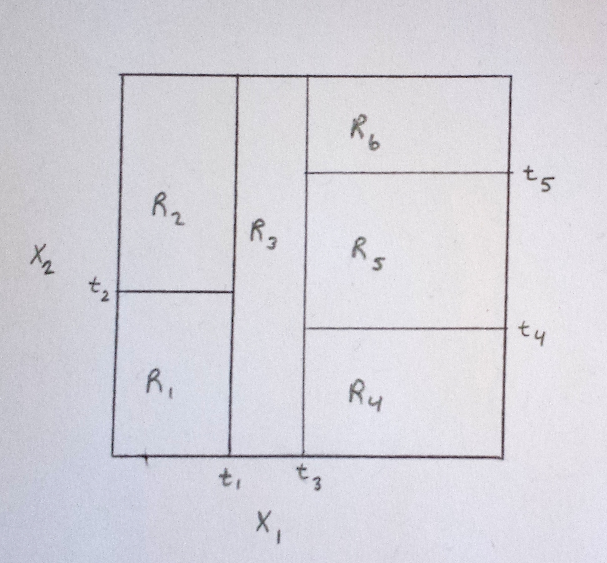
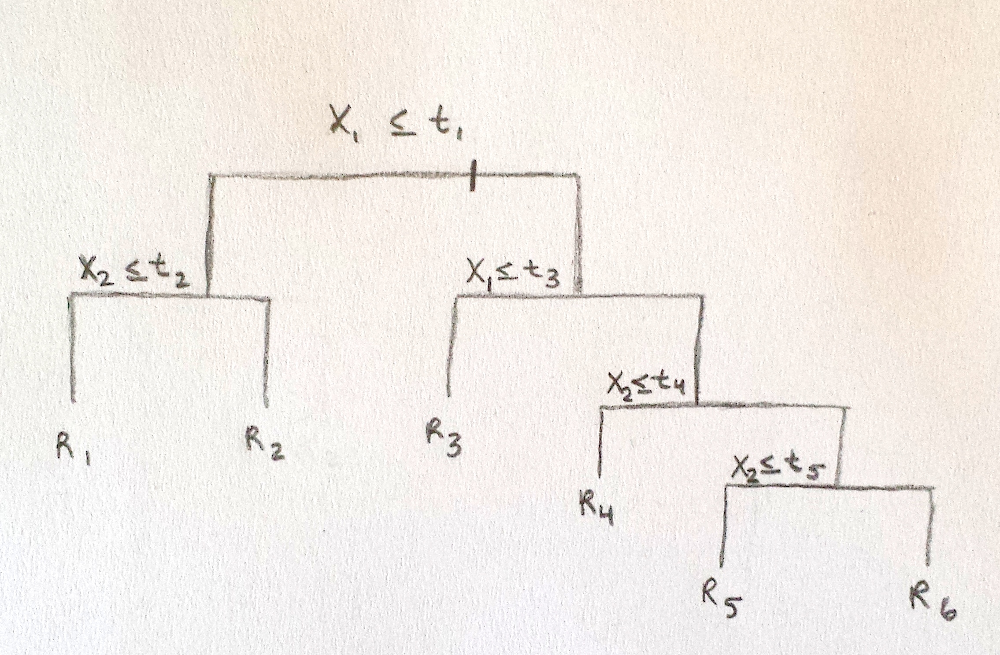
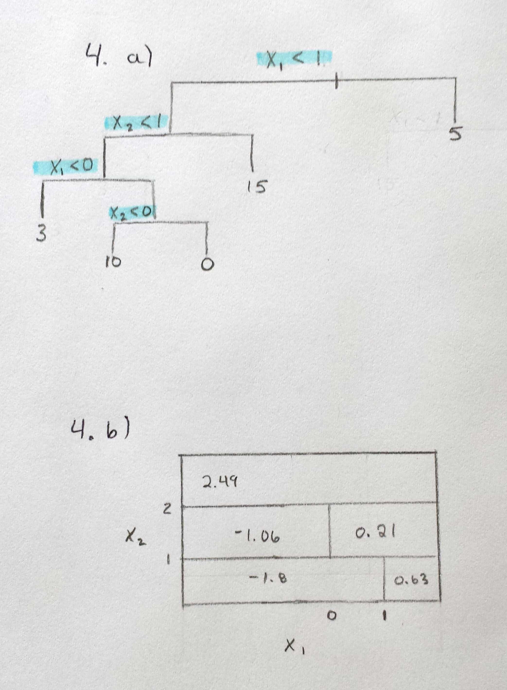

# Topic 8 Exercises: Tree-based models

### Hannah Sonsalla

## Programming Assignment
### 8.4.12

Apply boosting, bagging, and random forests to a data set of your choice.  Be sure to fit models on a training set and to evaluate their performance on a test set.  How accurate are the results compared to simple methods like linear or logistic regression?  Which of these approaches yields the best performance?

For this question I will use the Smarket data set to predict Direction variable (qualitative).
```{r}
library(ISLR)
data(Smarket)

# Train and test set
set.seed(1)
train = sample(nrow(Smarket), nrow(Smarket) / 2)
test = (-train)
Smarket$Direction = ifelse(Smarket$Direction == "Up", 1, 0)
Smarket.train = Smarket[train, ]
Smarket.test = Smarket[test, ]
nrow(Smarket.train)
nrow(Smarket.test)
```

#### Logistic Regression
```{r}
logit.fit = glm(Direction ~ Lag1 + Lag2 + Lag3 + Lag4 + Lag5 + Volume, data = Smarket.train, family = "binomial")
logit.probs = predict(logit.fit, newdata = Smarket.test, type = "response")
logit.pred = ifelse(logit.probs > 0.5, 1, 0)
table (logit.pred, Smarket.test$Direction)
mean(logit.pred != Smarket.test$Direction)
```

We have a classification error of 0.512. We continue with boosting.

#### Boosting
```{r}
library (gbm)
set.seed(1)
boost.fit = gbm(Direction ~ Lag1 + Lag2 + Lag3 + Lag4 + Lag5 + Volume, data = Smarket.train, distribution = "bernoulli", n.trees = 5000)
boost.probs = predict(boost.fit, newdata = Smarket.test, n.trees = 5000)
boost.pred = ifelse(boost.probs > 0.5, 1, 0)
table (boost.pred, Smarket.test$Direction)
mean(boost.pred != Smarket.test$Direction)
```
We have a classification error of 0.56. We continue with bagging.

#### Bagging
```{r}
library(randomForest)
set.seed(1)
bag.fit = randomForest(Direction ~ Lag1 + Lag2 + Lag3 + Lag4 + Lag5 + Volume, data = Smarket.train, mtry = 6)
bag.probs = predict(bag.fit, newdata = Smarket.test)
bag.pred = ifelse(bag.probs > 0.5, 1, 0)
table (bag.pred, Smarket.test$Direction)
mean(bag.pred != Smarket.test$Direction)
```

We have a classification error of 0.5088.  We end with random forests.

#### Random Forests
```{r}
rf.fit = randomForest(Direction ~ Lag1 + Lag2 + Lag3 + Lag4 + Lag5 + Volume, data = Smarket.train, mtry = 2)
rf.probs = predict(rf.fit, newdata = Smarket.test)
rf.pred = ifelse(rf.probs > 0.5, 1, 0)
table (rf.pred, Smarket.test$Direction)
mean(rf.pred != Smarket.test$Direction)
```
We have a classification error of 0.5136.

Thus, I conclude that bagging has the lowest classification error.

I also looked at the Hitters data set to predict Salary variable (quantitative).
```{r}
data(Hitters)
Hitters = na.omit(Hitters)

set.seed(1)
train = sample(c(TRUE, FALSE), nrow(Hitters), rep = TRUE)
test = (!train)
Hitters.train = Hitters[train, ]
Hitters.test = Hitters[test, ]
```

#### Linear Regression
```{r}
linear.fit = lm(Salary ~., data = Hitters.train)
linear.probs = predict(linear.fit, newdata = Hitters.test, type = "response")
mean((linear.probs - Hitters.test$Salary)^2)
```

We have an error of 160105.6. We continue with boosting.

#### Boosting
```{r}
set.seed(1)
boost.fit = gbm(Salary ~., data = Hitters.train, distribution = "gaussian", n.trees = 5000)
boost.probs = predict(boost.fit, newdata = Hitters.test, n.trees = 5000)
mean((boost.probs - Hitters.test$Salary)^2)
```
We have an error of 128810.4. We continue with bagging.

#### Bagging
```{r}
set.seed(1)
bag.fit = randomForest(Salary ~., data = Hitters.train)
bag.probs = predict(bag.fit, newdata = Hitters.test)
mean((bag.probs - Hitters.test$Salary)^2)
```
We have an error of 107712.3. We finish with random forests.

#### Random Forests
```{r}
rf.fit = randomForest(Salary ~., data = Hitters.train, mtry = 2)
rf.probs = predict(rf.fit, newdata = Hitters.test)
mean((rf.probs - Hitters.test$Salary)^2)
```
We have an error of 106271.3.

In conclusion, random forests have the lowest test error rate.

## Theory Assignment
### 8.4.1

Draw an example of a partition of two-dimensional feature space that could result from recursive binary splitting.  Example should contain at least six regions. Draw a decision tree corresponding to this partition.  Be sure to label all aspects of your figures, including the regions, cutpoints, etc. 





### 8.4.2 

It is mentioned in Section 8.2.3 that boosting using depth-one trees leads to an additive model.  Explain why this is the case.

In boosting, we add to the existing model not by fitting to the response. Instead, we fit to the residuals of the previous model. Thus, we are growing the trees sequentially and the approach learns slowly.  Therefore, each time we fit a new tree, we must know the residuals of the previous trees before we can add this tree to the model.  This makes the model additive.

A depth-one tree indicates that there is 1 split in each tree and the tree is a stump (consisting of a single split).  Since each stump is only a split in one variable (as shown in eq 8.12), the expanded form of the whole decision tree with B different stumps can be grouped into terms for splits by predictor, one for each predictor.  It can be written in the form shown in the problem statement which indicates that it is additive for each predictor.

### 8.4.3 

Consider Gini index, classification error and cross-entropy in a simple classification setting with two classes.  Create a single plot that displays each of these quantities as a function of pm1.  The x-axis should display pm1, ranging from 0 to 1, and the y-axis should display the value of the Gini index, classification error and entropy.
NOTE: pm1 = 1 - pm2

Gini Index:
G = pm1 (1-pm1) + pm2(1-pm2)
  = (1-pm2) (1-(1-pm2)) + pm2(1-pm2)
  = (1-pm2) pm2 + (1-pm2)pm2
  = 2(pm2)(1-pm2)
  = 2 * p * (1-p)
  
Class Error:
E = 1 - max(pm1) = 1 - max(1-pm2)
  = 1 - pmax(p, 1-p)
  
Cross-Entropy:
D = -(pm1 (logpm1) + pm2 (logpm2))
  = -((1-pm2))(log(1-pm2)) + pm2 (log pm2))
  = - (p * log(p) + (1 - p) * log(1 - p))

```{r}
p = seq(0, 1, 0.01)
gini.index = 2 * p * (1 - p)
class.error = 1 - pmax(p, 1 - p)
cross.entropy = - (p * log(p) + (1 - p) * log(1 - p))
matplot(p, cbind(gini.index, class.error, cross.entropy), col = c("red", "green", "blue"))
```


### 8.4.4

Relates to plots in Figure 8.12.  

a) Sketch tree corresponding to partition of predictor space illustrated in left-hand panel of Figure 8.12.

b) Create diagram similar to left-hand panel of Figure 8.12, using the tree illustrated in the right-hand panel of the same figure.  You should divide up the predictor space into the correct regions and indicate the mean for each region.



### 8.4.5

Suppose we prodcuce ten bootstrapped samples from a data set containing red and green classes.  We then apply a classification tree to each bootstrapped sample and for a specific value of X, produce 10 estimates of P(Class is Red|X): 0.1, 0.15, 0.2, 0.2, 0.55, 0.6, 0.6, 0.65, 0.7, and 0.75.

There are two common ways to combine these results together into a single class prediction.  One is the majority vote approach and the second approach is to classify based on the average probability.  In this example, what is the final classification under each of these two approaches?

1.  Majority Vote:  Under this approach, X would be classified as Red.  Six of the ten probabilities for the conditional probability (the class is Red given a value of X) are higher than 50%, meaning the class is Red.  Red is the most commonly occuring class for the 10 predicitons (6 for Red, 4 for Green).

2. Average Probability:  
```{r}
(0.1+0.15+0.2+0.2+0.55+0.6+0.6+0.65+0.7+0.75)/10
```

The average of the 10 probabilities is 0.45.  Thus, this classification would indicate that X is green as the conditional probability is less than 50%.
